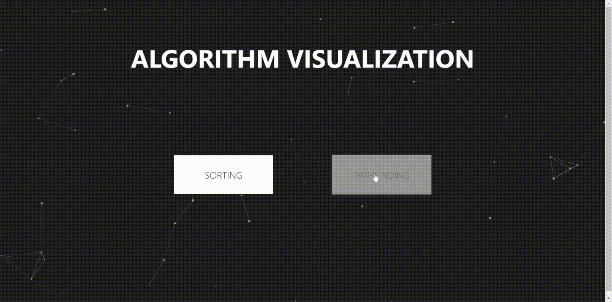

# Algorithm Visualization

An algorithm visualization app made using React, Sass. Bootstrapped with Create-React-app

Deployed in Heroku: https://algorithm-visual-react.herokuapp.com/

## Features

- Can visualize sorting algorithms like merge sort, insertion sort etc
- Can visualize pathfinding algorithms like A*, DFS, BFS etc

## Installation

```
git clone https://git-teaching.cs.bham.ac.uk/mod-ug-proj-2020/sxk1069.git
npm install
npm start
```

## Usage

<figure>
    
</figure>
<figure>
    
</figure>
<figure>
    
</figure>
